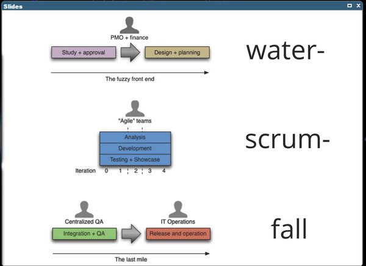

# What Agile NOT is !

## SCUM != Agile 

* SCRUM is a process, Agile is a culture! 
  * **Culture Eats Process for Breakfast**
* Anti-Pattern "_Water-Scrum-Fall_" (Quasi-Standard in most Industries)

<table><tr><td>

</td></tr></table>

# So what is Agile then?

**IT'S A CULTURE BASED ON TRUST, RESPECT & COURAGE.**

The core values and principles are defined in the "Manifesto for Agile Software-Development" - https://agilemanifesto.org/

- Individuals and interactions over processes and tools
- Working software over comprehensive documentation
- Customer collaboration over contract negotiation
- Responding to change over following a plan

## Individuals and interactions over processes and tools

* Let people who do the job creating the best working processes.
  - Respect peoples expertise to do the best to get the job done. (TRUST & RESPECT)
  - self-organized (autonomuous) teams => no project-manager needed anymore!!!
  - teams decide on their own what process they follow. For example one teams in an organization are using XP, another Scrum and a third team does Kanban
* Very often, other people (external experts, management etc) create processes on paper. (example Time-Manager at Toyota) 
* Management is supporter, not the commander. Let the people do the job and management helps to setup the best working environment for the people. 

## Working software over comprehensive documentation

* Working software is the primary measure of progress.
* Don't documents by excel sheets, traffic lights / percentages on slides or other documents.
* After all, the working software is the reason for the project.
* With agile approaches, project teams spend more time on development and less time on documentation, resulting in a more efficient delivery of a working product.

### TIP:
_Stop producing a document and see who complains. If someone misses the paperwork, ask why the document is necessary. In fact, ask, “Why?” five times to get to the root reason the document is missed. When you know the core reason for the report, see how you can satisfy that need with a streamlined process._

## Customer collaboration over contract negotiation

Do you experienced following scenario:

* Boss/Manager A asks Boss/Manager B: How long do you need to build that software?
* Boss B: Well, my developers said, 9 months, with 10 developers full-time.
* Boss A: Oh, thats too long. We need it faster. Can't you make it faster. Maybe 3 months?
* Boss B: No, 3 months is impossible.
* Boss A: Ok, then maybe 6 months.
* Boss B: No, never. But maybe 8 months...
..._negotation continues_...

Not even time and budget will be defined like that, also what kind of tools, which partners or team and many other things. The problem with this is that noone cares abouth the real solution. Its just important whats written into the contract. By that the focus to solve the problem is lost totally.

You can adapt this scenario to other setup where people negotiate. But the should collaborate instead.

### So what would be the agile way ?

* Start with small slices which delivers value to the customer. 
* Just pay for these small pieces ("Agile Contracting"). You could just pay for 1 or 2 iterations and see whats the outcome. 
* After each iteration, you can decide to continue or stop the collaboration.
* Further you can give immediate feedback and adjust the direction of the project in case its needed. So you have direct influence how the project goes on.
* By that you work on solving the actual problem, not fullfilling a contract. YOU REALLY COLLABORATE!
  
_**CONVICE BY QUALITY, NOT BY CONTRACT**_

Old way is to focus on time and budget. The result in the industry was, that even when time and budget was met, the software didn't do what is was meant to do. "Operation erfolgreich, Patient tot!"

## Responding to change over following a plan

* Plans are PREDICTIVE and Agile Working is ADAPTIVE !
* Whats the problem with plans?
  * We must predict the future and humans are really bad in predicting the future! We are just guesing and running a business based on guessing seems not to be the best way. See also _#NoEstimates_ https://www.youtube.com/watch?v=QVBlnCTu9Ms
* Since the requirements will change for sure, the plan has to change too. This can happen very often. So why maintaining a plan at all when its always changing?
* Focus on changing the teams, skills and software to solve the actual problem.
* Adjusting/Adapting to the volatile needs of customer and market is the core of BEING AGILE.
* When you cannot change easily and fast to new requirements (these can affect team, skills and of course requirements of the software), you cannot fullfill the real needs of the market.

# OTHER PERSPECTIVE ON AGILE

Defintion by Dave Thomas:

1. Find out where you are
2. Take a small step towards your goal (and if there are multiple choices here, take the path of least regret, or the one that makes future change easier)
3. Adjust your understanding based on what you learned
4. Repeat

Awesome talks about Agilility?

* https://www.youtube.com/watch?v=a-BOSpxYJ9M - "Agile is dead" by Dave Thomas
* https://www.youtube.com/watch?v=HZyRQ8Uhhmk - "Agile is dead" by Allen Holub
* https://www.youtube.com/watch?v=QVBlnCTu9Ms - "No Estimates" by Allen Holub
* https://www.youtube.com/watch?v=GE6lbPLEAzc - "Explaining Agile" - by Martin Fowler and Neal Ford
* https://www.youtube.com/watch?v=zNvmjPzdqKc - "A Retake on the Agile Manifesto" (jump to timestamp 28:04)"

