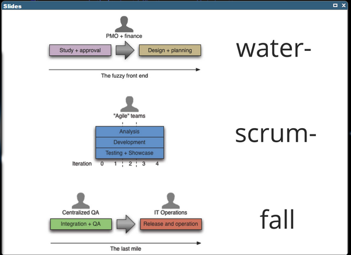

# What Agile NOT is !

## SCUM != Agile

- SCRUM is a process, Agile is a culture!

  - **Culture Eats Process for Breakfast**
  - So when you have a NON-Agile culture, then the processes doesn't matter that much.

- It's very hard to transform a company into an Agile organization. That's why you rarly see REAL agile companies. One result was this Anti-Pattern called "_Water-Scrum-Fall_" (Quasi-Standard in most Industries):

<table><tr><td>

</td></tr></table>

# So what is Agile then?

**IT'S A CULTURE BASED ON TRUST, RESPECT & COURAGE!!!**

When you live these values, then you can be agile as an organization. Follow these principles:

- Agility affects the entire organization. (not only IT) - It's holistic!
- The teams (all teams) define processes and tools, not the management
- Management acts as a servant
- Its adaptive, not predictive. Estimates are predictive.
- Nobody is ordering around somebody. (Self-organized teams)
- You embrace uncertainties und adapt to change. In the entire organization!
- You follow the rule "Compass-Over-Map"
- Every decision is value-driven, not time or cost-driven.
- Results are open-ended. You cannot plan them!

The core values and principles are defined in the "Manifesto for Agile Software-Development" - https://agilemanifesto.org/

- Individuals and interactions over processes and tools
- Working software over comprehensive documentation
- Customer collaboration over contract negotiation
- Responding to change over following a plan

## Individuals and interactions over processes and tools

- Let those who do the work design their own working processes.
  - Respect people’s expertise — they are the right ones to improve and change their workflows. (**TRUST & RESPECT**)
  - Self-organized (autonomous) teams → no need for a project manager anymore!
  - Teams decide independently which process they follow. For example, one team might use XP, another Scrum, and a third Kanban.

- Very often, processes are defined by others (external experts, management, etc.) on paper. That is **not** agile! Let the people define the processes they work within — they know best what can be improved.

- Management should act as a supporter or servant, not as a commander. Let people do their job while management focuses on creating the best possible work environment. The main responsibility of management is to remove any kind of obstacles.

## Working software over comprehensive documentation

- Working software is the primary measure of progress.
- Don't document progress by excel sheets, traffic lights / percentages on slides or other documents.
- After all, the working software is the reason for the project.
- With agile approaches, project teams spend more time on development and less time on documentation, resulting in a more efficient delivery of a working product.

### TIP:

_Stop producing a document and see who complains. If someone misses the paperwork, ask why the document is necessary. In fact, ask, “Why?” five times to get to the root reason the document is missed. When you know the core reason for the document, see how you can satisfy that need with a streamlined process._

## Customer collaboration over contract negotiation

Do you experienced following scenario:

- Boss/Manager A asks Boss/Manager B: How long do you need to build that software?
- Boss B: Well, my developers said, 9 months, with 10 developers full-time.
- Boss A: Oh, thats too long. We need it faster. Can't you make it faster. Maybe 3 months?
- Boss B: No, 3 months is impossible.
- Boss A: Ok, then maybe 6 months.
- Boss B: No, never. But maybe 8 months...
  ..._negotation continues_...

This is a typical scenario in the software industry. The outcome of this dialog defines time, budget, tools you have to use or what partners/teams you have to work with. The problem with this is that nobody cares abouth the real solution. Its just important whats written into the contract. By that the focus to solve the problem is lost totally!

### So what would be the agile way ?

Collaborate instead of negotiate !

- Start with small slices which delivers value to the customer.
- Customer just pays for this small piece ("Agile Contracting"). You could just pay for 1 or 2 iterations and see whats the outcome.
- After each iteration, you or the client can decide to continue or stop the collaboration.
- Furthermore the client can give immediate feedback and adjust the direction of the project in case its needed. So you have direct impact on how the project goes on.
- By that you work on solving the actual problem, not fullfilling a contract. YOU REALLY COLLABORATE!

_**YOU CONVICE BY QUALITY, NOT BY CONTRACT !**_

Old way is to focus on time and budget (contract). The result in the industry was, that even when you are in time & budget, the software didn't do what is was meant to do. You just delivered crap in time & budget. In other words "Surgery successfull, but patient dead!"

## Responding to change over following a plan

- Plans are PREDICTIVE and Agile Working is ADAPTIVE !
- Whats the problem with plans?
  - We must predict the future and humans are really bad in predicting the future! We are just guessing and running a business based on guessing seems not to be the best way. See also _#NoEstimates_ https://www.youtube.com/watch?v=QVBlnCTu9Ms
- Since the requirements will change for sure, the plan has to change too. This can happen very often. So why maintaining a plan at all when its always changing?
- Focus on changing the teams, skills and software to solve the actual problem.
- Adjusting/Adapting to the volatile needs of customer and market is the core of BEING AGILE.
- When you cannot change easily and fast to new requirements (these can affect team, skills and of course requirements of the software), you cannot fullfill the real needs of the market.

# Agile Word Cloud

<table><tr><td>

</td></tr></table>

# OTHER PERSPECTIVE ON AGILE

Defintion by Dave Thomas:

1. Find out where you are
2. Take a small step towards your goal (and if there are multiple choices here, take the path of least regret, or the one that makes future change easier)
3. Adjust your understanding based on what you learned
4. Repeat

# Links / Videos

Awesome talks about Agilility?

- https://www.youtube.com/watch?v=a-BOSpxYJ9M - "Agile is dead" by Dave Thomas
- https://www.youtube.com/watch?v=HZyRQ8Uhhmk - "Agile is dead" by Allen Holub
- https://www.youtube.com/watch?v=QVBlnCTu9Ms - "No Estimates" by Allen Holub
- https://www.youtube.com/watch?v=GE6lbPLEAzc - "Explaining Agile" - by Martin Fowler and Neal Ford
- https://www.youtube.com/watch?v=zNvmjPzdqKc - "A Retake on the Agile Manifesto" (jump to timestamp 28:04)"
